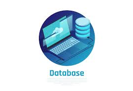

# Base de Datos
> En este repositorio se encuentran temas en relaciión a base de datos, diseño, lenguaje sql, manejo de sitemas gestores de base de datos como MySQL y Microsoft SQL Server

Los temas que se encuentran en el repositorio, son:
1. Fundamentos de Base de Datos.
2. Modelado de Base de Datos
3. Construcción de Base de Datos
4. Lenguaje estructurado de consulta

